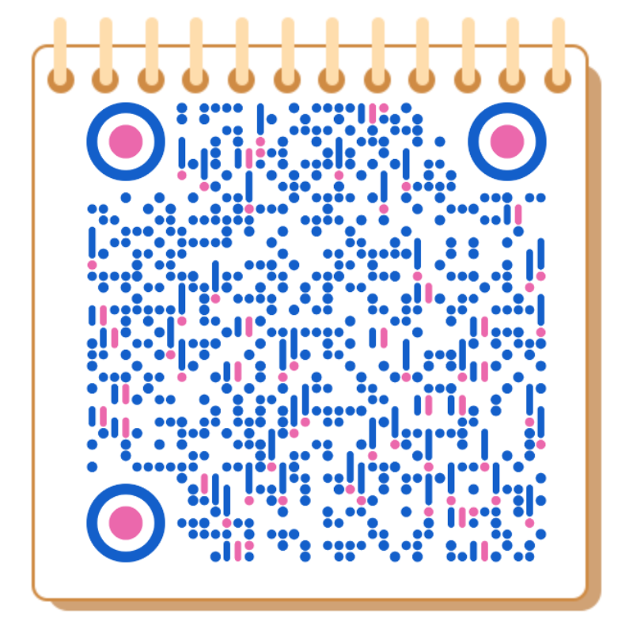

# 大话西游之HPC

## HPC 从 0 到 1 系统性学习资料汇总

### 勇者招募

目标做成至少在中文互联网里质量最高、最详细的 HPC 文档，但由于我们团队的几位作者终究是时间有限，我们希望更多的有志之士能够加入我们和我们一起做这个文档。如果你对 HPC 这件事情很感兴趣并且每周能固定拿出 3 小时以上投入到文档里，我们诚挚邀请你加入我们。

## 正文

> 主要作者简介：
>
> * Hank，计算机本硕，7年大数据与人工智能应用从业者，曾就职 YIMIAN by Ascential、腾讯、高榕资本，目前正在探索 AI 领域的创业机会
> * Ginwiahzy，目前北京大学计算机本科大四就读，下学期本校就读 PhD，主要研究方向形式化验证和理论计算机科学，目前正在探索 AI 如何提升科研/日常工作流的效率 如果你有兴趣加入这个文档的创作、或者加入我的团队、或者单纯是想了解最新的资讯，请联系下面这个微信加入微信讨论群
> * Ringi，数字经济硕士，10年IT大数据HPC与AI工作场景、工作于 BGI、国家超算中心，目前专注于人工智能在生物医药的探索与研究

如果你有兴趣加入这个文档的创作、或者加入我的团队、或者单纯是想了解最新的资讯，请联系下面这个微信公众号、留言加入微信讨论群

### 相关链接

关于HPC文档本站是基于 Vercel 建成的网站：https://ml.genetind.com/

### 文档介绍

#### 这个文档不适合谁

* **第一，这不是个“游戏攻略”**：

如果你是一个纯粹的玩家，也不关心 HPC 的是什么、为什么和能干什么，那么这个文档可能不太适合你。在这个文档里我们比较少地提及了具体的操作步骤，比如，怎么魔法上网，怎么注册账号，怎么把HPC整理成册，而且网络上已经有足够多的这一类的教程，我们就不过多赘述了。

* **第二，这也不是个代码教学教程**：

如果你是正在寻找一个本地部署HPC大规模集群的代码教程，那么这个教程同样可能也帮不到你。虽然在这个文档里提及了非常多 HPC、和AI的知识，但极少地涉及具体的代码。

### 内容模块简介

#### 1. 基础介绍

#### 2. 实操技巧

> **纸上得来终觉浅，绝知此事要躬行**

#### 6. 其他

#### 7.关于作者

